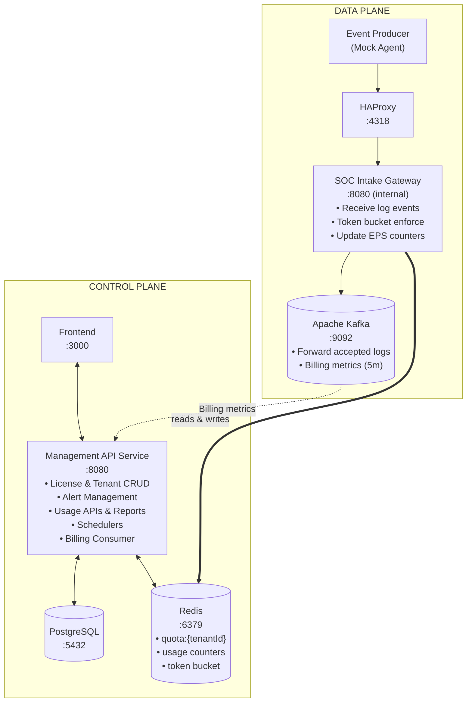

# SOC EPS License Management Platform

A multi-tenant SOC/SIEM platform for managing EPS (Events Per Second) licenses, enforcing usage quotas in real-time, and providing operational dashboards with alerting capabilities.

---

## Table of Contents

- [System Flow](#system-flow)
- [Architecture](#architecture)
- [Services](#services)
- [Tech Stack](#tech-stack)
- [Redis Key Schema](#redis-key-schema)
- [Database Schema](#database-schema)
- [API Reference](#api-reference)
- [Getting Started](#getting-started)
- [Manual Testing Guide](#manual-testing-guide)

---

## System Flow

### Overview

The platform operates on a **Control Plane / Data Plane** split architecture. Here's how all the pieces work together:



### Step-by-Step Flow

#### 1. Admin tạo Tenant & License (Control Plane)

```
Admin (Frontend) → POST /api/v1/tenants         → PostgreSQL (tenants table)
Admin (Frontend) → POST /api/v1/licenses         → PostgreSQL (licenses table)
                                                  → Redis SET quota:{tenantId} = epsQuota
```

Khi admin tạo license, hệ thống **tự động sync EPS quota vào Redis** dưới key `quota:{tenantId}`. Đây là cầu nối giữa Control Plane và Data Plane — SOC Intake Gateway chỉ cần kiểm tra quota thông qua Redis và dùng Lua script để quản lý tokens.

#### 2. Event Producer gửi events (Data Plane)

```
Event Producer → POST /api/v1/logs → HAProxy → SOC Intake Gateway
Headers:
  X-Tenant-ID: "uuid"
  X-Agent-Name: "agent-1"
Body:
  [{ "log.source": "firewall", "timestamp": "...", "payload": {...} }]
```

Event Producer mô phỏng agent/sensor thực tế, gửi batch events liên tục theo target EPS đã cấu hình. Hỗ trợ multi-tenant qua biến `TENANT_IDS`.

#### 3. Intake Gateway xử lý events (Data Plane)

1. **Token Rate Limiting (Dynamic Prefetching Algorithm)**: 
   - Gateway duy trì token in-memory cho từng tenant. Nếu hết, nó sẽ gọi Lua script trên Redis để xin trước một lượng `prefetch = quota * 2` (tối thiểu 50).
   - Redis áp dụng thuật toán **Token Bucket** theo cửa sổ thời gian (`window_size = 300` giây).
   - Tổng tokens cho phép trong 1 window: `limit = quota * burst_multiplier * window_size` (với `burst_multiplier` mặc định là 3).
2. **Quota Check**: Trả về `429 Too Many Requests` hoặc chỉ accept số lượng hợp lệ nếu vượt quá quota.
3. **Usage Metrics**: Lưu metrics vào in-memory và định kỳ flush vào Redis mỗi 3 giây qua Pipeline (gồm các dimensions: time window, agent, logsource).
4. **Publish**: Các event được chấp nhận (accepted) sẽ được gửi vào Kafka topic, metrics flush vào Kafka mỗi 5 phút cho billing downstream.

#### 4. Schedulers kiểm tra và tạo alerts (Control Plane)

```
AlertTriggerScheduler (chạy mỗi phút, tại giây thứ 5: "5 * * * * *"):
  → Scan tất cả active tenants
  → Đọc API Usage tính % sử dụng của phút trước (previous minute)
  → ≥ 70%?  → Tạo USAGE_70_PERCENT / USAGE_100_PERCENT alert
  → < 70%?  → Auto-resolve OPEN alerts

LicenseExpirationScheduler (chạy mỗi 5 phút: "0 */5 * * * *"):
  → Query licenses: status=ACTIVE AND endDate BETWEEN today AND today+7 ngày
  → Tạo LICENSE_EXPIRING_SOON alert (DEDUP)
  → (Có sleep 3s giữa các alert để tránh rate limit của Mailtrap)
```

#### 5. Frontend hiển thị Dashboard (Control Plane)

```
Admin Dashboard:
  → GET /api/v1/usage/summary       → Tất cả tenants + EPS + % usage
  → GET /api/v1/alerts?status=OPEN  → Danh sách cảnh báo
  → GET /api/v1/licenses/expiring-soon → License sắp hết hạn

Tenant Dashboard:
  → GET /api/v1/usage/{tenantId}/current  → EPS hiện tại, quota, dropped today
  → GET /api/v1/usage/{tenantId}/history  → 24h time-series cho biểu đồ
  → GET /api/v1/alerts?tenantId=X         → Alerts của tenant
  → GET /api/v1/reports/usage/csv         → Export CSV báo cáo
```

---

## Architecture

### Design Decisions

| Decision | Rationale |
|---|---|
| **Control/Data Plane split** | Intake Gateway (hot path) không gọi DB → latency thấp |
| **Token Bucket trong Redis (Lua script)** | Atomic, persistent, hỗ trợ multi-instance (HAProxy load balancing) |
| **Kafka Integration** | Đảm bảo reliable delivery và decoupling cho hệ thống (Data Plane) |
| **Scheduler-based alerts** | Tách alert trigger khỏi intake hot path, không ảnh hưởng throughput |

### Mocked Components

| Production Component | Mock |
|---|---|
| Real Agent/Sensor | `event-producer` |
| Downstream SOC pipeline | Kafka Consumer placeholder (trong Data Plane thực tế) |

---

## Services

| Service | Port | Description |
|---|---:|---|
| management-api-service | 8080 | Control Plane — License, Tenant, Alert, Usage, Report APIs |
| soc-intake-gateway | 8080 (int) | Data Plane (Go) — Receive logs, Rate limit, Metrics, Publish to Kafka |
| haproxy | 4317/4318 | Load balancer cho SOC Intake Gateway |
| frontend | 3000 | React Dashboard — Admin & Tenant views |
| postgres | 5432 | PostgreSQL — Tenants, Licenses, Alerts, Audit Logs, Keycloak DB |
| redis | 6379 | Redis — Quota cache, Token Bucket state, EPS Counters |
| kafka | 9092 | Apache Kafka — Message queue cho accepted logs |
| keycloak | 8180 | Identity & Access Management |
| prometheus | 9090 | Metrics collection |
| grafana | 3001 | Dashboards for Metrics |
| event-producer | — | Mock event generator (configurable EPS, multi-tenant) |

---

## Tech Stack

| Layer | Technology |
|---|---|
| Backend (Control) | Java 25, Spring Boot, Spring Data JPA, Spring Data Redis |
| Backend (Data) | Go, Gin/net-http, go-redis, confluent-kafka-go |
| Database | PostgreSQL 16 |
| Cache/State | Redis 7 |
| Message Broker | Apache Kafka 3.7.0 |
| IAM | Keycloak 24.0 |
| Frontend | React 19, TypeScript, Vite, Recharts |
| Infra & Monitoring| HAProxy, Prometheus, Grafana, Docker Compose |

---

## Redis Key Schema

| Key Pattern | Type | TTL | Description |
|---|---|---|---|
| `quota:{tenantId}` | String | None | EPS quota (synced from API/Control Plane) |
| `rl:tokens:{tenantId}:{window}`| String | 600s (10m) | Số token đã cấp trong window_size 300s hiện tại |
| `usage:{tenantId}:*:1m:{window}` | String (counter) | 48h | Metrics (received/accepted/dropped) theo phút |
| `usage:{tenantId}:*:5m:{window}` | String (counter) | 7 ngày | Metrics theo cửa sổ 5 phút |
| `usage:{tenantId}:*:15m:{window}`| String (counter) | 14 ngày | Metrics theo cửa sổ 15 phút |
| `usage:{tenantId}:*:1d:{window}` | String (counter) | 90 ngày | Metrics theo ngày |
| `usage:{tenantId}:dim:*:{window}`| String (counter) | Giống trên | Dimensions theo agent và logsource (1m/5m/15m/1d) |

---

## Database Schema

```sql
tenants (tenant_id UUID PK, name, status, created_at, updated_at)
licenses (license_id UUID PK, tenant_id FK, eps_quota, start_date, end_date, status, created_at, updated_at)
alerts (alert_id UUID PK, tenant_id FK, license_id FK nullable, alert_type, severity, status, message, threshold_percent, current_percent, triggered_at, resolved_at, created_at, updated_at)
audit_logs (audit_log_id UUID PK, actor, action, resource_type, resource_id, before_value JSONB, after_value JSONB, created_at)
```

---

## API Reference

### Management API (`:8080`)

*(CRUD endpoints cho Tenant, License, Alert, Usage)*

| Method | Endpoint | Description |
|---|---|---|
| `POST` | `/api/v1/tenants` | Create tenant |
| `POST` | `/api/v1/licenses` | Create license |
| `GET` | `/api/v1/alerts` | List alerts |
| `GET` | `/api/v1/usage/summary` | Get EPS usage summary |

### SOC Intake Gateway API (`HAProxy :4318` -> `Gateway :8080`)

| Method | Endpoint | Description |
|---|---|---|
| `POST` | `/api/v1/logs` | Gửi batch events (Yêu cầu `X-Tenant-ID` header) |
| `GET` | `/health` | Health check |
| `GET` | `/metrics` | Prometheus metrics |

---

## Getting Started

### Prerequisites

- Docker & Docker Compose

### Run

```bash
# Start all services
docker compose up --build -d

# Stop
docker compose down

# Stop and remove volumes (clean reset)
docker compose down -v
```

### Service URLs

| Service | URL |
|---|---|
| Frontend Dashboard | http://localhost:3000 |
| Management API | http://localhost:8080 |
| Intake Gateway (HAProxy) | http://localhost:4318 |
| Management Swagger | http://localhost:8080/swagger-ui.html |
| Grafana | http://localhost:3001 (admin/admin) |
| Keycloak | http://localhost:8180 (admin/admin) |
| Prometheus | http://localhost:9090 |

---

## Manual Testing Guide

### 1. Create Tenant

```bash
curl -X POST http://localhost:8080/api/v1/tenants \
  -H "Content-Type: application/json" \
  -d '{"name": "Tenant A"}'
```

Copy the returned `tenantId`.

### 2. Create License

```bash
curl -X POST http://localhost:8080/api/v1/licenses \
  -H "Content-Type: application/json" \
  -d '{
    "tenantId": "<tenant-id>",
    "epsQuota": 100,
    "startDate": "2026-06-01",
    "endDate": "2026-12-31"
  }'
```

Verify Redis quota:

```bash
docker exec -it soc-redis redis-cli GET "quota:<tenant-id>"
# Expected: "100"
```

### 3. Send Logs (Data Plane)

Gửi logs qua HAProxy tới Intake Gateway.

```bash
curl -X POST http://localhost:4318/api/v1/logs \
  -H "Content-Type: application/json" \
  -H "X-Tenant-ID: <tenant-id>" \
  -H "X-Agent-Name: agent-1" \
  -d '[
    {
      "log.source": "firewall",
      "timestamp": "2026-06-23T10:00:00Z",
      "payload": {"sourceIp": "10.0.0.1", "port": 443}
    }
  ]'
```

- Trả về `202 Accepted` (nếu hợp lệ).
- Trả về `429 Too Many Requests` (nếu vượt quota hoàn toàn).

### 4. Check Metrics

Xem metrics trong Grafana (http://localhost:3001) hoặc Dashboard UI (http://localhost:3000).

---

## Project Structure

```
soc-license-platform/
├── apps/
│   ├── management-api-service/    # Control Plane (Spring Boot - Java)
│   ├── soc-intake-gateway/        # Data Plane (Go, Kafka, Redis, Prometheus)
│   ├── frontend/                  # React Dashboard (Vite + TypeScript)
│   └── event-producer/            # Mock Agent (Node.js + TypeScript)
├── docker-compose.yml
├── haproxy.cfg                    # HAProxy Load Balancer config
├── prometheus/                    # Prometheus config
├── grafana/                       # Grafana provisioning & dashboards
├── keycloak/                      # Keycloak realm export
└── README.md
```
